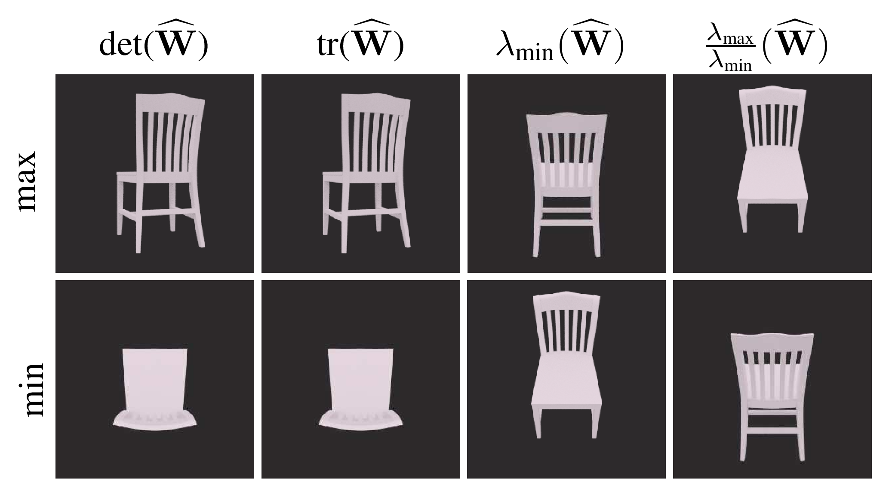

# Observability Properties of Object Pose Estimation

This is the code for the paper

**Observability Properties of Object Pose Estimation**

Trevor Avant & Kristi A. Morgansen, *American Control Conference (ACC) 2019*

## Code

Before running this code you should install [Blender](https://www.blender.org), add this repository to your `PYTHONPATH` (because the `pose_estimation` directory is structured as a Python package), and change the directories in `pose_estimation/directories.py` to directories on your computer.

* **Figure 1**: run `python pose_estimation/gramian/example.py`
	* this figure was generated by letting `name = cone`, and changing `render_props.eps` to several different values

* **Figure 2**: run `python pose_estimation/gramian/epsilon.py`

* **Figure 3**: run `python pose_estimation/gramian/example.py`
	* uncomment `name = ...` for different models

* **Figure 4**: run `python pose_estimation/gramian/best_views.py`

* **Figure 5**: run `python pose_estimation/gramian/dynamic_object.py`

* **Figure 6**: run `python pose_estimation/gramian/trajectories.py` and then `blender --background --python pose_estimation/gramian/trajectories_plot.py`
	* you will have to run the second command twice: once with `draw_opt_curves('min')` uncommented at the end, and once with `draw_opt_curves('max')` uncommented

## Blender models

The Blender models for the chair, lamp and car are originally from [blendswap.com](https://www.blendswap.com) (and we made some modifications to the original models). All of the original models are licensed under Creative Commons [CC BY](https://creativecommons.org/licenses/by/3.0/) licenses which permit sharing and adaptation if attribution is given. The links to the original models are:

* [chair](https://www.blendswap.com/blends/view/40140)
* [lamp](https://www.blendswap.com/blends/view/46257)
* [car](https://www.blendswap.com/blends/view/69075)

Note that if other .blend models are to be used in this project, the 3D model must be part of a scene named "Scene". Additionally, if the model in consists of multiple objects, all objects should be parented to an object called "all_parts".
